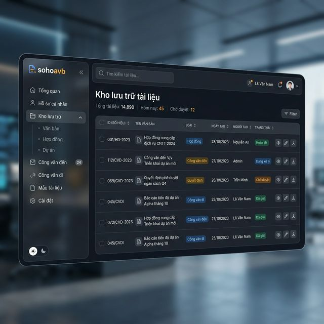
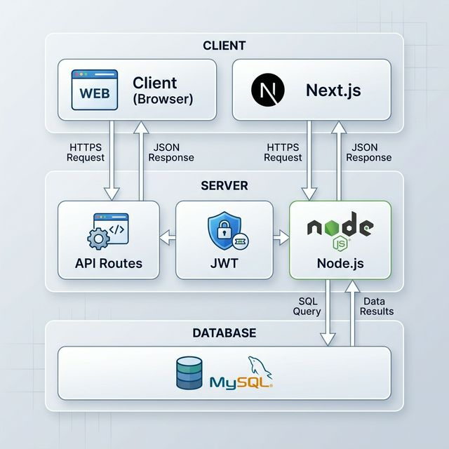
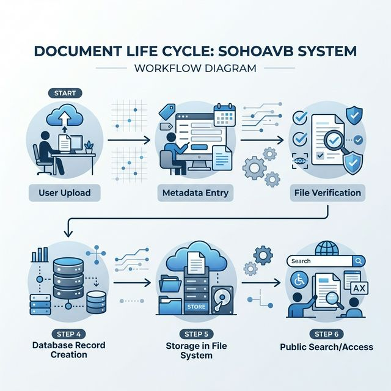

# BÁO CÁO TỔNG KẾT DỰ ÁN: HỆ THỐNG SỐ HÓA VĂN BẢN (SOHOAVB)

**Kính gửi:** Ban Lãnh đạo Trung tâm KT&ĐBCLGD
**Ngày báo cáo:** 19 tháng 03 năm 2026
**Đơn vị thực hiện:** Đội ngũ Phát triển Phần mềm

---

## I. MỤC TIÊU DỰ ÁN
Dự án **sohoavb** được triển khai nhằm hiện đại hóa quy trình quản lý văn bản hành chính, thay thế các phương thức lưu trữ truyền thống bằng một nền tảng số hóa tập trung. Mục tiêu chính bao gồm:
1. **Tối ưu hóa tìm kiếm**: Rút ngắn thời gian tra cứu văn bản từ hàng giờ xuống còn vài giây.
2. **Lưu trữ an toàn**: Đảm bảo dữ liệu văn bản được sao lưu và bảo mật chặt chẽ.
3. **Nâng cao hiệu suất**: Giúp việc chia sẻ và xử lý công văn giữa các phòng ban trở nên nhanh chóng và minh bạch.

## II. GIẢI PHÁP KỸ THUẬT
Chúng tôi đã áp dụng các công nghệ tiên tiến nhất để xây dựng một hệ thống ổn định, tốc độ cao và thân thiện với người dùng:

### 1. Nền tảng Công nghệ (Tech Stack)
- **Giao diện (Frontend)**: Sử dụng **Next.js 15 & React 19**, mang lại trải nghiệm mượt mà, phản hồi ngay lập tức cho người dùng.
- **Dữ liệu (Backend & Database)**: Sử dụng **Node.js** kết hợp với **MySQL**, hỗ trợ quản lý hàng chục ngàn văn bản với chỉ mục tìm kiếm thông minh.
- **Bảo mật**: Hệ thống mã hóa mật khẩu đa lớp (Bcrypt) và cơ chế xác thực JWT, đảm bảo chỉ người dùng được cấp quyền mới có thể truy cập dữ liệu.

### 2. Kiến trúc & Thiết kế Hệ thống
Hệ thống được thiết kế theo cấu trúc phân lớp (Client-Server-Database), giúp dễ dàng bảo trì và nâng cấp.

### 3. Quy trình Xử lý (Flowchart)
Chúng tôi đã thiết kế một quy trình số hóa khép kín, từ khâu tải lên đến khi văn bản được lưu trữ và có thể tìm kiếm công khai.

## III. CÁC TÍNH NĂNG NỔI BẬT ĐÃ HOÀN THÀNH

### 1. Quản lý Kho Lưu trữ Thông minh
Hệ thống tự động phân loại văn bản theo các đầu mục: Công văn đến, Công văn đi, Văn bản nội bộ. Giao diện bảng biểu trực quan hiển thị đầy đủ thông tin: Số hiệu, Loại văn bản, Trích yếu và Năm ban hành.

### 2. Công cụ Tìm kiếm Toàn diện
Người dùng có thể tìm kiếm theo bất kỳ từ khóa nào xuất hiện trong trích yếu văn bản. Ngoài ra, bộ lọc nâng cao cho phép khoanh vùng theo năm hoặc loại văn bản một cách chính xác.

### 3. Quy trình Tải lên & Phê duyệt Đơn giản
Quy trình tải lên văn bản chỉ mất 3 bước, hệ thống tự động ghi lại người thực hiện và thời gian để dễ dàng theo dõi (audit trail).

### 4. Chia sẻ & Liên kết Nội bộ
Tính năng chia sẻ cho phép gửi nhanh tài liệu cho đồng nghiệp trong hệ thống mà không cần thông qua các công cụ gửi file bên ngoài, giúp tăng cường bảo mật nội bộ.

## IV. ĐÁNH GIÁ CHẤT LƯỢNG & BẢO MẬT
- **Hiệu năng**: Hệ thống tải trang và tìm kiếm trong thời gian < 1 giây.
- **Độ tin cậy**: Cơ sở dữ liệu MySQL đảm bảo tính toàn vẹn dữ liệu, không xảy ra sai sót trong quá trình lưu trữ.
- **Trải nghiệm người dùng (UX)**: Giao diện hiện đại, hỗ trợ cả Dark Mode, giúp người dùng làm việc trong thời gian dài mà không mỏi mắt.

## V. KẾT LUẬN & HƯỚNG PHÁT TRIỂN
Hệ thống **sohoavb** đã hoàn thành và sẵn sàng đi vào vận hành chính thức. Đây là khởi đầu cho lộ trình chuyển đổi số toàn diện của Trung tâm.

**Các bước tiếp theo đề xuất:**
- Tích hợp tính năng ký số (Digital Signature).
- Phát triển ứng dụng di động để tra cứu văn bản mọi lúc mọi nơi.
- Ứng dụng AI để tự động phân tích và phân loại nội dung văn bản khi tải lên.

---
**Đại diện Đội ngũ Dự án**
*(Đã ký)*
**Admin - Hệ thống sohoavb**
