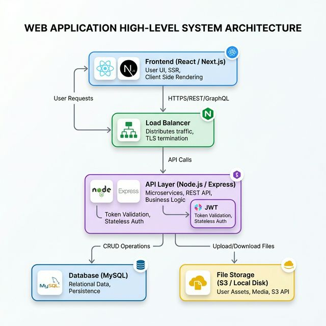
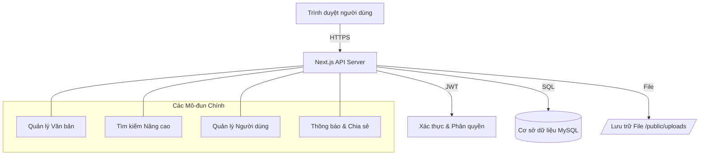

# Hệ thống Quản lý Văn bản - sohoavb

## 1. Giới thiệu tổng quan
**sohoavb** (Số hóa văn bản) là một nền tảng quản lý và lưu trữ văn bản hiện đại, được thiết kế chuyên biệt cho các cơ quan, đơn vị cần quản lý công văn đến, công văn đi và các tài liệu nội bộ một cách khoa học, bảo mật và hiệu quả.

Hệ thống cung cấp giao diện trực quan, khả năng tìm kiếm nâng cao và quy trình quản lý tài liệu tối ưu, giúp giảm bớt gánh nặng giấy tờ và tăng cường hiệu suất làm việc.

## 2. Các tính năng chính
- **Kho lưu trữ tập trung**: Lưu trữ toàn bộ văn bản tại một nơi duy nhất với phân loại rõ ràng.
- **Phân loại văn bản**: Tự động phân loại thành Công văn đến, Công văn đi, Văn bản khác.
- **Tìm kiếm nâng cao**: Tìm kiếm theo số hiệu, trích yếu (Full-text search), loại văn bản và năm ban hành.
- **Đánh dấu quan trọng**: Ưu tiên các văn bản cần xử lý ngay bằng tính năng "Quan trọng".
- **Chia sẻ tài liệu**: Chia sẻ văn bản nhanh chóng giữa các thành viên trong hệ thống.
- **Quản lý người dùng**: Hệ thống phân quyền Admin/User chặt chẽ.
- **Giao diện hiện đại**: Hỗ trợ chế độ Sáng/Tối (Dark Mode) và tương thích tốt trên nhiều thiết bị.

## 3. Kiến trúc và Thiết kế Hệ thống
Hệ thống được xây dựng trên nền tảng Fullstack hiện đại, đảm bảo tính ổn định và khả năng mở rộng.

### 3.1. Sơ đồ Kiến trúc Tổng thể

### 3.2. Thiết kế Hệ thống Chi tiết

### 3.3. Lưu đồ Xử lý Văn bản

### Công nghệ sử dụng:
- **Frontend**: Next.js 15, React 19, Tailwind CSS, Framer Motion (hiệu ứng chuyển động).
- **Backend**: Next.js API Routes (Node.js).
- **Database**: MySQL (Quản lý dữ liệu quan hệ và chỉ mục tìm kiếm).
- **Security**: JWT (Authentication), Bcrypt (Mã hóa mật khẩu).

## 4. Hướng dẫn sử dụng

### 4.1. Đăng nhập
1. Truy cập vào địa chỉ hệ thống.
2. Nhập **Tên đăng nhập** và **Mật khẩu**.
3. Hệ thống sẽ chuyển bạn đến Dashboard dựa trên vai trò của bạn.

### 4.2. Tìm kiếm văn bản
- **Tìm nhanh**: Nhập nội dung vào ô tìm kiếm chính (Trích yếu).
- **Bộ lọc**: Sử dụng các bộ lọc ở phía dưới để lọc theo **Số hiệu**, **Loại văn bản** hoặc **Năm ban hành**.
- **Sắp xếp**: Bạn có thể sắp xếp kết quả theo Ngày tải lên mới nhất, Số hiệu hoặc Năm.

### 4.3. Tải lên văn bản mới
1. Nhấn nút **"Tải VB mới"** ở góc trên bên phải.
2. Điền các thông tin: Số hiệu, Loại văn bản, Trích yếu, Ngày ban hành.
3. Chọn file (PDF, Docx, v.v.) và nhấn **"Tải lên"**.

### 4.4. Quản lý tác vụ
- **Xem file**: Nhấn trực tiếp vào tên văn bản để xem trực tuyến.
- **Chỉnh sửa/Xóa**: Sử dụng menu ba chấm (Thao tác) ở cuối mỗi dòng văn bản.
- **Chia sẻ**: Chọn văn bản -> Menu Thao tác -> Chia sẻ -> Chọn người nhận.
- **Thao tác hàng loạt**: Chọn nhiều văn bản bằng checkbox để xóa hoặc chia sẻ cùng lúc.

## 5. Hướng dẫn cho Quản trị viên (Admin)
- Admin có thêm quyền truy cập mục **"Người dùng"** trong Sidebar.
- Tại đây, Admin có thể tạo mới tài khoản, chỉnh sửa thông tin hoặc xóa tài khoản người dùng trong hệ thống.
- Admin có quyền xóa bất kỳ văn bản nào để dọn dẹp kho lưu trữ.

---
*© 2024 Trung tâm KT&ĐBCLGD - Hệ thống Số hóa Văn bản.*
